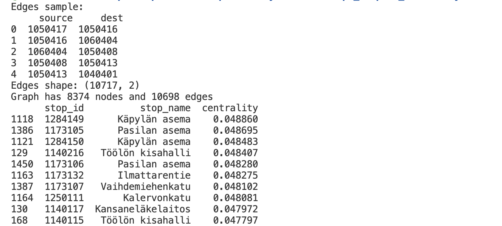

## Title
# public-transport-analytics
Hello! This reprository will shows my practice with the Public Transport Network &amp; Timetables of the Helsinki dataset.
This project allows to analyze this data set and find the closeness centrality stops for a better work of planning daily trips.

---
[](https://www.python.org/)
[](LICENSE)


## Quickstart

### Command Line
```bash 
python -m venv .venv
# macOS/Linux
source .venv/bin/activate
# Windows Powershell
# .\.venv\Scripts\Activate.ps1
pip install -r requirements.txt

# 1) Create tables 
python -m src.Step1_tables_creation.create_db
python -m src.Step1_tables_creation.add_trip_db
python -m src.Step1_tables_creation.add_stop_time_db
python -m src.Step1_tables_creation.add_calendar

# 2) Load data
python -m src.Step2_tables_filling.fill_trip
python -m src.Step2_tables_filling.stop_times
python -m src.Step2_tables_filling.fill_stops
python -m src.Step2_tables_filling.fill_calendar

# 3) Compute centrality
python -m src.Step3_compute_centrality.build_test_graph.py
```

## Project structure
```
├── images/                        # store result of the top10 stops you should have in the end 
├──required_data/                  # put GTFS .txt files here (not tracked)
├── src/
│   ├── Step1_tables_creation/     # create SQLite schema
│   ├── Step2_tables_filling/      # load GTFS files into tables
│   └── Step3_compute_centrality/  # build graph, compute centrality, save plots
├── gtfs.db                        # generated SQLite database
├── README.md
└──  requirements.txt
```

## Data
- Source: HSL GTFS https://infopalvelut.storage.hsldev.com/gtfs/hsl.zip
- Required files: `stops.txt`, `trips.txt`, `stop_times.txt`, `calendar.txt`
- Place them under `required_data/data/gtfs`

## Method
1. Create SQLite tables (`stops`,`trips`,`calendar`,`stops_time`)
2. Load GTFS CSVs
3. Build an **undirected, unweighted** graph from stop paris
4. Compute closeness centrality per stop (NetworkX)

## Results

*Top10 stops by closeness centrality.*
*Might be different if you use the different GTFS package.*

## Configuration
- Edit paths and parameters in `src/.../*.py` (e.g., `DB_PATH`, `TOP_N`)
- Change input folder via `required_data/...` constants

## Troubleshooting
- To avoid many of the errors, follow the way of directories "Step1, Step2, Step3"
- Ensure the right path of the gtfs table


